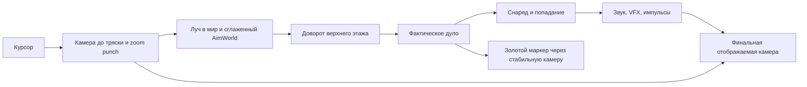

# 03. Прицеливание, удар камеры и перенос в UE

**Эталон: Iron Citadel 0.7.0.** Значения для старта настройки — [parameters.json](parameters.json). Разделы с пометкой «Рекомендация UE» описывают предлагаемое устройство, а не готовую реализацию в Unreal.

## 1. Разделить три направления

Игрок указывает **намерение мышью**; верхний этаж догоняет намерение; оружие стреляет из **фактического дула**. Камера показывает последствия выстрела, но не меняет исходный луч мыши своим косметическим ударом.



Не подавать Render обратно в Ray. Даже большая тряска не должна сама заставлять башню переводить огонь. Смещение башни физической отдачей и обычное сопровождение камеры могут менять решение наведения — это реальное движение, в отличие от декоративного shake.

## 2. Курсор → точка в мире

1. Взять позицию мыши в viewport без экранного сглаживания.
2. Построить ray из ортографической `AimCamera`, в которой ещё нет shake/kick/zoom_punch.
3. Пересечь ray с плоскостью земли Godot Y=0. Сохранить отдельный `GroundAim` для упреждения камеры.
4. Трассировать 180 м по mask 97. Если первый hit относится к мишени, утвари или врагу — использовать точку поверхности. Иначе оставить точку земли. Обычная стена блокирует этот ray, но не имеет target metadata: намерение в таком случае остаётся на земле; реальный снаряд всё равно должен встретить стену.
5. Сгладить мировую точку: `AimWorld = lerp(AimWorld, DesiredWorld, 1−exp(-22dt))`.

Сглаживание точки убирает скачок глубины при пересечении силуэта высокой цели. Постоянная времени 1/22 ≈ 45,5 мс; за ≈136 мс проходит 95% одиночного изменения DesiredWorld. Это не дополнительное ожидание перед началом наведения. GroundAim не подменять точкой на стене или голове врага: иначе высота цели начнёт сдвигать камеру и дёргать тот же ray.

## 3. Поворот верхнего этажа и вертикальный угол пушки

В формулах ниже оси Godot: вверх +Y, вперёд −Z.

```text
V = AimWorld − TurretWorldPosition
DesiredYaw = atan2(-V.x, -V.z)
Error = shortest_signed_angle(TurretYaw, DesiredYaw)
Step = clamp(Error × (1 − exp(-dt / max(AimLag, 0.02))),
             -TurretSpeed × dt, +TurretSpeed × dt)
TurretYaw += Step
Turret.WorldRotation = (0, TurretYaw, 0)

V = AimWorld − GunPitchWorldPosition
DesiredPitch = clamp(atan2(V.y, length(V.xz)), -0.60, +0.15)
GunPitch = lerp(GunPitch, DesiredPitch, 1 − exp(-18dt))
```

| Параметр | Значение |
|---|---:|
| AimLag | 0,18 с, постоянная времени |
| Максимальная скорость yaw | 3,1 рад/с = 177,617°/с |
| Максимальный шаг yaw при 60 Hz | 2,960° |
| Pitch | −34,377°…+8,594° |
| Сглаживание pitch | 18/с, постоянная времени 55,6 мс |

Для небольшой ошибки yaw без ограничения скорости одиночный скачок отрабатывается примерно на 63% за 180 мс и 95% за 540 мс. Большая ошибка дополнительно ограничена скоростью. Это относится к фиксированной цели yaw; полная цепь мышь→AimWorld→yaw содержит оба фильтра.

Переход через ±180° всегда идёт коротким путём. Поворот корпуса не переприсваивает мировой yaw верхнего этажа. После походки/качания заново стабилизировать мировой pitch/roll верхнего этажа; оставить отдельный вертикальный gun pivot. Стрелять сразу по его фактическому трансформу без проверки «прицел уже совпал».

## 4. Два маркера HUD

**Курсор намерения:** следует за мышью сразу. В готовности цвет #ede9da, при перезарядке пушки #edb96d. Центр r=1,8 px, четыре штриха от 7 до 15 px, цветная толщина 1,5 px поверх чёрной 4 px. Вокруг курсора кольцо перезарядки r=24 px, 48 сегментов, старт сверху, толщина 2 px.

**Золотой маркер ствола:** ray из фактического дула вперёд на 85 м, первый hit mask 97 либо конец ray. Спроецировать через ту же `AimCamera`, не через финальную трясущуюся камеру. Это предварительный показ попадания пушки, не точка цели мыши и не отдельный арбалетный прицел. Радиус 6 px, кольцо 1,4 px, центральная точка 1,5 px.

```text
DesiredPixel = AimCamera.Project(ActualCannonHit)
Delta = (DesiredPixel − GunReticle) × (1 − exp(-16dt))
GunReticle += limit_length(Delta, 1200 × dt)  // px
Alpha = lerp(Alpha, visible ? 1 : 0, 1 − exp(-20dt))
```

При первом валидном появлении установить позицию сразу; после посадки/сброса очистить initialized. Валидность: координаты конечные, перед AimCamera и внутри viewport с отступом 20 px. Если невалиден, остановить движение маркера и плавно убрать alpha; не тащить его через экран. Снаружи башни маркер пушки скрыт.

Связь с курсором — восемь точек на долях i/10, i=1…8. Их alpha: `0,30 × smoothstep(24,64,d) × (1−smoothstep(300,420,d)) × reticle_alpha`, где d — расстояние маркеров в px. На малом расстоянии линия исчезает, на чрезмерном не засоряет экран. Hit-confirm: четыре диагональных штриха от `(±18,±18)` до `(±25,±25)` px у мыши, alpha = hit_pulse; надпись «ПОПАДАНИЕ» отдельно в верхней части HUD.

Размеры прицела в эталоне задаются **viewport-пикселями**: общий масштаб нижней панели к ним не применяется. Для UE DPI scaling выбрать базовый viewport 1440×900 и проверить фактический экранный размер. Ограничение 1200 px/с — тоже экранное, а не см/с. Вне 48 м золотой маркер ещё может показывать цель, до которой болты арбалетов уже не долетают.

## 5. Базовая камера

Эталон ортографический. `FocusTarget = FollowedActor + Up×0,75 м + Lead`, где FollowedActor — башня либо центр вышедшего отряда. `Lead = limit_length((GroundAim−FollowedActor) по горизонтали ×0,13, 2,8 м)`. Focus догоняет цель с alpha = `1−exp(-5dt_real)`.

AimCamera стоит в `Focus + (24,24,24)` м Godot и смотрит на Focus. Угол вниз ≈35,264°, расстояние до Focus ≈41,569 м. Сохраняется вертикальный охват 24 м; колесо меняет его шагом 1,5 м в диапазоне 18…42 м. Это рабочий масштаб, относительно которого оценивались силуэты, VFX и толчки.

В UE `Ortho Width` задаёт **горизонтальный** охват. Поэтому для такого же кадра `OrthoWidth_cm = GodotVerticalSize_m × 100 × AspectRatio`: на 1440×900 это 3840 см, на 1920×1080 — ≈4266,67 см. Не копировать число 24 непосредственно в UE Width. [Документация Epic по ортографической камере](https://dev.epicgames.com/documentation/en-us/unreal-engine/orthographic-camera-in-unreal-engine).

## 6. Удар камеры

Один выстрел пушки одновременно добавляет Trauma +0,8 с clamp до 1, направленный kick −Dground×0,6 м и устанавливает zoom_punch = 1,3 м. Shot flash alpha = 0,14. Это четыре разные реакции, не один произвольный CameraShake.

На каждом render-update по игровому dt:

```text
time += dt
trauma = max(0, trauma − 1.9dt)
kick *= exp(-10dt)
zoom_punch *= exp(-7dt)
flash_alpha = max(0, flash_alpha − 4dt)
shake = trauma² × ShakeStrength

WorldOffset = (sin(time×103)×0.44,
               cos(time×91)×0.25,
               sin(time×117)×0.35) × shake          // метры Godot
RenderPosition = AimCameraPosition + WorldOffset + kick×ShakeStrength
RenderLocalRoll = sin(time×85) × shake × 0.011      // радианы
RenderVerticalSize = BaseVerticalSize + zoom_punch×ShakeStrength
```

Default ShakeStrength = 1. При нуле выключаются shake, camera kick и zoom punch; flash, физическая отдача, hitstop и звук остаются. Значения 103/91/117/85 — рад/с, **не Hz**; соответствующие частоты ≈16,39/14,48/18,62/13,53 Hz. Фаза общая, не сбрасывается на каждом выстреле.

При одиночном выстреле из покоя начальное состояние trauma 0,8 даёт коэффициент 0,64: огибающие амплитуд world X/Y/Z до 0,2816/0,1600/0,2240 м, roll до 0,403°. Сами тригонометрические значения не обязаны одновременно достигать пика. Во время первой отрисовки decay уже мог уменьшить их: это значения состояния до render-update. Полное затухание trauma без новых событий ≈421 мс. При trauma=1 предельный roll ≈0,630°.

Направленный kick до 60 см — сдвиг **против горизонтальной составляющей выстрела**, без повторной нормализации Dground. После 100 мс останется 36,8% kick. Zoom punch увеличивает ортографический охват, то есть резко **отдаляет** кадр и возвращает его с постоянной времени 1/7 с. На 1440×900 начальные +1,3 м высоты равны +208 см UE OrthoWidth; его тоже нужно пересчитывать при смене aspect. Flash исчезает за 35 мс непрерывного времени, обычно за несколько кадров.

Попадание добавляет отдельную травму: `amount × clamp(1 − distance(Tank,Hit)/45 м, 0,15, 1)`, amount=0,38 обычный impact или 0,65 большой. Затвор пушки добавляет +0,15 в конце Reload. Арбалеты только поднимают trauma до 0,13. Все источники смешиваются до нелинейного квадрата; не запускать независимые бесконтрольно суммируемые shakes на каждый болт.

**Рекомендация UE:** единый компонент импульсов локального игрока с отдельными каналами trauma/kick/zoom/flash. Сначала вычислять и хранить базовую камеру для deprojection, потом накладывать косметическую реакцию. Уменьшение интенсивности в настройках доступности не должно менять наводку или урон. Пространственные оси offset преобразовать по правилу ниже; roll применять вокруг локальной оси взгляда.

## 7. Время, hitstop и порядок событий

Эталон использует 60 физических тиков/с. Shot задаёт `freeze=0,045 с`; в начале следующих физических тиков арена уменьшает freeze на dt и возвращается, не обновляя мех, экипаж, врагов, наводку, летящие снаряды и обе перезарядки. Текущий тик не прерывается: новый пушечный снаряд ещё успевает пройти `_update_shells` в тик рождения. Около трёх следующих тиков пропускаются.

Render `_process`, VFX и аудио при этом продолжаются. Картинка тела кратко замирает, а камера, дым и звук дают ощущение резкого удара. Это не полная пауза приложения. Сквозной порядок внутри tank tick: движение → пружины/походка → наводка пушки → Reload пушки → арбалеты → новый выстрел пушки. Поэтому импульс, записанный после обновления позы, применяется к mesh на следующем разрешённом тике.

| Система | Часы в эталоне | Во время shot hitstop |
|---|---|---|
| Пружины, урон/полёт, reload, gun aim | Физический игровой dt | Стоят |
| AimWorld в обычном режиме | Физический игровой dt | Стоит |
| Камера: сопровождение | Render dt / time_scale | Продолжается |
| Trauma, zoom/kick decay, HUD, VFX | Render игровой dt | Продолжаются |
| AimWorld в прицеле супердэша | Дополнительно render real dt | Продолжается |
| Аудио one-shot | Часы аудио + pitch | Продолжается |

Супердэш при наводке применяет time_scale=0,15. Сопровождение камеры остаётся отзывчивым по реальному времени, а часть VFX/огибающих замедляется. Замедление не является эффектом обычного выстрела.

**Рекомендация UE:** явно разделить игровое время оружия и косметическое время. В одиночном сравнении воспроизвести указанные 45 мс. Для сетевого боя предложить локальный визуальный hitstop: серверный полёт/урон не должен зависеть от остановки кадра одного клиента. Это изменение сетевой семантики требует отдельного решения команды; Godot-прототип не подтверждает готовую сетевую схему. Применять глобальный Time Dilation к боевому миру лишь ради этого эффекта не требуется.

## 8. Контексты ввода

| Контекст | ЛКМ / пушка | ПКМ / арбалеты | Перезарядки |
|---|---|---|---|
| Экипаж внутри, обычный бой | Клик + буфер 0,18; удержание повторяет | Клик / удержание очереди | Идут |
| Обычный дэш или уже исполняемый супердэш | Разрешена при остальных gates | Новая ПКМ разрешена | Идут |
| Прицел супердэша / pending commit | Выстрел блокирован | ПКМ подтверждает супердэш, без болта | Идут по игровому времени |
| Экипаж снаружи | Кнопка принадлежит отряду | Кнопка принадлежит отряду | Идут у живой башни |
| Смена посадки | Буфер очищен; ждать отпускания ЛКМ/ПКМ/Space | Trigger отменён; тот же release guard | Состояние сохраняется |
| Настройки открыты | Заблокирована | Trigger отменён | Идут |
| Указатель над управляющим UI | Новый выстрел блокирован | Trigger отменяется | Идут |
| Shot hitstop | Ждать следующего разрешённого тика | Ждать следующего разрешённого тика | Стоят |

**Особенности прототипа:** Tab не очищает удерживаемую ЛКМ, поэтому после закрытия настроек пушка может продолжить огонь без нового нажатия. При потере фокуса явно отменяются арбалеты и дэш, но отдельной отмены пушечного удержания нет. Во время запрещённого режима буфер пушки может успеть истечь. Пушечная перезарядка останавливается после смерти башни; арбалетный tick продолжает обслуживать уже выпущенные болты и свой таймер, новые выстрелы запрещены.

**Рекомендация UE:** при потере фокуса/смене gameplay context очищать held и buffered input обоих оружий и требовать release перед возобновлением. Сохранить reload/ammo. В Enhanced Input можно использовать отдельные действия CannonFire, CrossbowFire, DashAim/Commit и состояния Started/Completed/Canceled; проверки разрешения должны существовать и в оружии. Это предложенное исправление контекстов, а не идентичное поведение Tab в 0.7.0. [Документация Epic по Enhanced Input](https://dev.epicgames.com/documentation/unreal-engine/enhanced-input-in-unreal-engine).

## 9. Единицы и структура UE

UE использует левую систему координат с +Z вверх, +X вперёд, +Y вправо; Godot-прототип использует +Y вверх и −Z вперёд. [Описание осей UE у Epic](https://dev.epicgames.com/documentation/unreal-engine/coordinate-system-and-spaces-in-unreal-engine).

Для этого handoff предлагаем явное соответствие векторов:

```text
UE_Position_cm = 100 × (-Godot.z, Godot.x, Godot.y)
UE_Direction   =       (-Godot.z, Godot.x, Godot.y)
UE_Length_cm   = Godot_Length_m × 100
UE_Angle_deg   = Godot_Angle_rad × 180 / π
```

Положительный Godot yaw при таком сопоставлении означает отрицательный UE heading yaw. Не копировать три Euler-компоненты по именам: особенно крен, оси пружины корпуса и произвольные вращения арбалетов. Преобразовать базис/направление, затем получать ориентацию средствами UE. Для камеры offset становится `(−2400; +2400; +2400)` см; взгляд на Focus соответствует yaw ≈−45°, pitch ≈−35,264°.

**Рекомендуемое разделение ответственности:**

| Компонент / данные | Ответственность |
|---|---|
| Weapon tuning asset | Числа из parameters.json, без зашитых таймингов в VFX |
| Aim solution | Ray, AimWorld, фактические yaw/pitch, trace ствола |
| Cannon / Crossbow logic | Разрешение, cooldown/ammo, выстрел, переходы состояний |
| Weapon presentation | Реакция на Shot/Eject/Chamber/Lock/Ready/Impact; mesh, VFX и звук |
| Camera impulse component | Только локальные trauma, kick, zoom, flash |
| HUD | Намерение, фактический ствол, cooldown/ammo и подтверждение damage |

Таймер оружия определяет готовность, animation notify лишь оформляет момент. При падении FPS не потерять порог Reload и не создать его дважды. В сетевой версии заранее разделить авторитетный Shot/Hit и предсказанные локальные эффекты: подтверждение сервера не должно второй раз воспроизводить собственный звук и kick. Конкретный GAS/Blueprint/C++ стек команда выбирает под боевой проект.

## 10. Источники

[arena.gd](reference/source/arena.gd): `_update_aim`, `_update_actual_hit`, `_update_camera`, `_process`, `_physics_process`, `_input`. [tank.gd](reference/source/tank.gd): `tick`, `_update_gun_aim`. [hud.gd](reference/source/hud.gd): `update_reticle`, `_draw_crosshair`. [crew.gd](reference/source/crew.gd) и [tower_dash.gd](reference/source/tower_dash.gd): блокировки и переходы управления.
